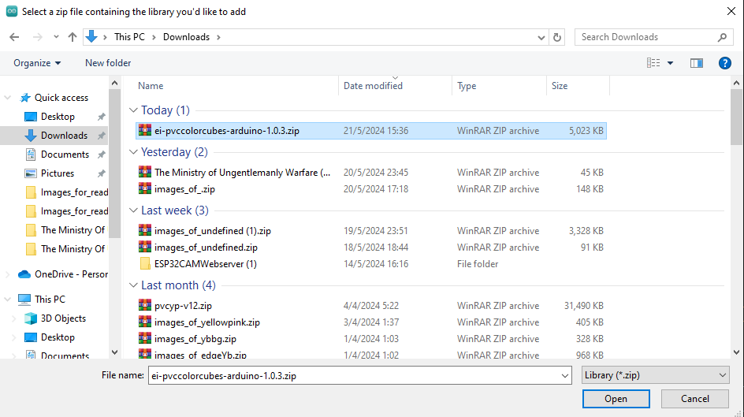

# FOMO-object-detect-stream
This is indended for streaming [FOMO object detection model](https://edge-impulse.gitbook.io/docs/edge-impulse-studio/learning-blocks/object-detection/fomo-object-detection-for-constrained-devices) by [Edge Impulse](https://edgeimpulse.com/) inference results from Esp32 to webserver. To use this script users must obtain a model from Edge Impulse

## What you'll need
- [Arduino IDE](https://www.arduino.cc/en/software), preferably the latest ones, but older versions will still do the job.
- [NodeJS](https://nodejs.org/en/download/package-manager/current) provide access points for inference results

## Project files descriptions

1. FOMO_object_detect_stream.ino - Containes Arduino codes for streaming camera images to the webserver and posting inference results to NodeJS.
2. index.html - Contains HTML elements for streaming and inferencing.
3. index.js - Javascript functions for HTML element for streaming and inferencing.
4. api.js - NodeJS access point for processing inference results for index.js.
5. styles.css - makes webserver looks more lively.

## How to install and run the project

1.  <strong> Download the zip file and extract it to Arduino directory </strong>   

    
2.  <strong> Go to the instatllation directory and install javascript dependencies. Run the api.js script, NodeJS is required for this process. </strong>  
  - For users with an IDE, linux, or Mac navigate to the directory and enter "npm install" follow by "node api.js".   
  
     
- For Window users, navigate to the directory then select the file path and type cmd. New terminal window will be opened in the folder directory.   
 
 
- Enter "npm install" follow by "node api.js"   
 
       
3.  <strong> Open FOMO_object_detect_stream.ino and enter WIFI SSID, PASSWORD, and the IPV4 address obtained from your PC. </strong>   

   
  - To find IPV4 For Window users, open cmd and enter "ipconfig".   
       
  - To find IPV4 For Linux users, open terminal and enter hostname -I   
       
    
4. <strong> Add zip folder of the model obtained from Edge Impulse to Arduino IDE. </strong>   

  

    
5. <strong> Under tools change your Board to "ESP32S3 Dev Module" and PSRAM to "OPI PSRAM". </strong>  

    
6. <strong> Upload the code to your ESP32S3. This process may take up to 20 to 30 minutes, once completed copy the IP address from the serial monitor to use it for process 9. </strong>   

    
7. <strong> Go to directory and open index.html, it should open the default browser and ask for IP Addres. Paste the Ip address obtain from Arduino IDE in process 7. </strong>   

    
9. <strong> Done!! the inference results from Esp32 should be shown in the webserver. </strong>  
  
    
## Webserver features
- User can switch languages on the top right corner of the web. 
- Adjustable Camera Settings, try to match camera settings with training datasets, to see more details about each setting please visit [
https://heyrick.eu/blog/index.php?diary=20210418&keitai=0](https://heyrick.eu/blog/index.php?diary=20210418&keitai=0). 
- User can hide the setting console by clicking on the icon above.  

   
- Adjustable Resolutions.   

   
- Capture button will start capturing images of detected objects.  
- Set Instances to limit the amount of images captured.   
- Once capture button is clicked a timer will start to count number of seconds it took to capture all images.   

    
- Download button located on the top left will zip all captured images into a single file and download. The downloaded images will not have labels. 
- Clear buttons located on the top right will delete all captured images. 
- User can aslo delete each image individually.  

      
## Credit
Thanks to [WIRELESS SOLUTION ASIA CO.,LTD](https://wirelesssolution.asia/) for providing AIOT board to support this project. Also thanks to [RandomNerdTutorials]([RandomNerdTutorial](https://RandomNerdTutorials.com/esp32-cam-video-streaming-web-server-camera-home-assistant) for providing essential codes for streaming Esp32 camera to webserver. Scripted used for Esp32 FOMO object detection inferencing were from [Edge Impulse](https://edge-impulse.gitbook.io/docs/edge-impulse-studio/learning-blocks/object-detection/fomo-object-detection-for-constrained-devices). 
